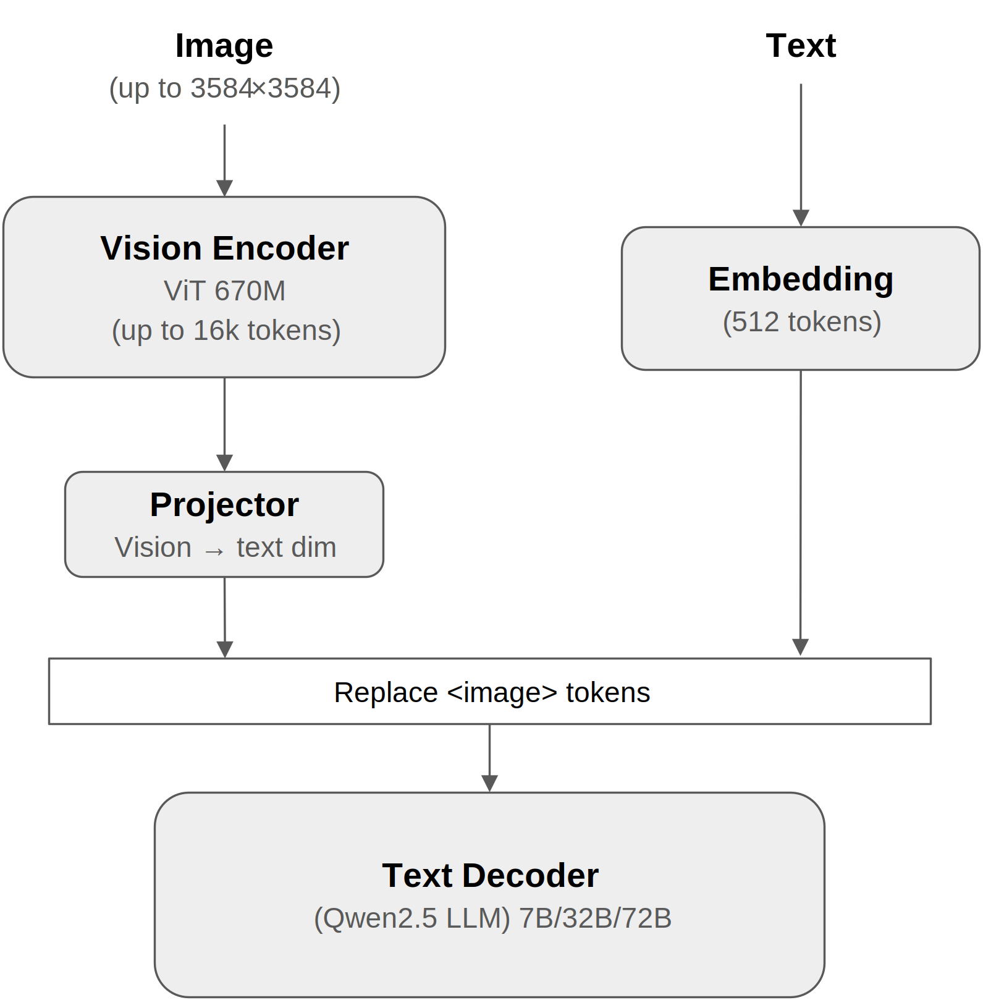
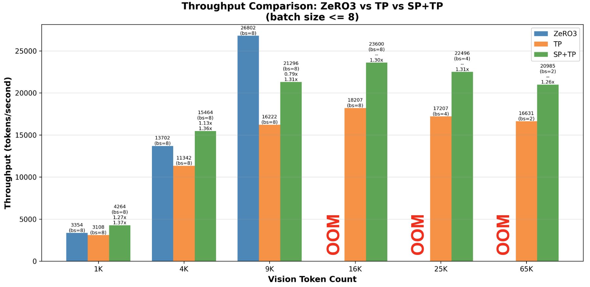

# Disaggregated Hybrid Parallelism with Ray

A framework for training vision-language models using disaggregated hybrid parallelism, where each model component adopts its optimal parallelization strategy independently.

## Overview

Modern vision-language models (VLMs) present a fundamental training challenge: they consist of **heterogeneous components** with vastly different computational and memory characteristics, making uniform parallelization strategies inefficient.

### The Heterogeneity Problem

Vision-language models combine two components with fundamentally mismatched characteristics:

**Vision Encoder** (Small Model, Long Sequences)
- **Parameters**: ~500M-6B (relatively small)
- **Sequences**: Up to 65k tokens per high-resolution image
- **Computation**: Fast per iteration (smaller model, often sparse attention)
- **Bottleneck**: Activation memory scales with sequence length (B×S×H)

**Text Decoder** (Large Model)
- **Parameters**: 7B-72B (10-100× larger than vision)
- **Computation**: Slower per iteration (much larger model, dense attention)
- **Bottleneck**: Model states scale with parameter count (M×20 bytes with mixed precision + AdamW)

This asymmetry creates a fundamental challenge: **the vision encoder is memory-bound by activations, while the text decoder is memory-bound by parameters**.

### Why Uniform Parallelization Fails

Existing distributed training frameworks (DeepSpeed, Megatron-LM) assume **uniform parallelization strategies** across all model components. This creates severe inefficiencies:

**Tensor Parallelism (TP):**
- ✅ Efficient for large text models (partitions parameters across GPUs)
- ❌ **Inefficient for small vision encoders**: Small hidden dimensions make communication overhead dominate computation time, creating a bottleneck

**Data Parallelism / ZeRO3 (parameter sharding):**
- ✅ Works well for short sequences that fit in memory
- ❌ **Critical limitation**: Minimum batch size per GPU = 1, causing OOM errors with long sequences (65k tokens)
- ❌ **Real-world impact**: Researchers must downscale images (896×896 vs 3584×3584), resulting in a **16× reduction in trainable sequence length** compared to hardware capability

### Our Solution: Disaggregated Hybrid Parallelism (DHP)

This repository implements **disaggregated hybrid parallelism (DHP)** using Ray, allowing each model component to adopt its optimal parallelization strategy:

**✅ Vision Encoder: Sequence Parallelism (SP) + ZeRO1 (data parallel + optimizer states sharding)**
- Implements DeepSpeed-Ulysses style sequence parallelism [1] to split long sequences across GPUs
- Activation memory scales linearly with GPU count: B×S×H/N per GPU
- Avoids tensor parallelism overhead for small models
- Communication pattern: All-to-All operations enable efficient attention across partitioned sequences
- Particularly effective with sparse attention patterns (see Qwen2.5-VL results below)

**✅ Text Decoder: Tensor Parallelism (TP)**
- Efficiently partitions large models: model memory = M×20/N per GPU (mixed precision + AdamW)
- Dense computation amortizes TP communication cost
- Essential for fitting 7B-72B parameter models in memory

**Key Insight**: Heterogeneous models need heterogeneous parallelization strategies. By disaggregating components and choosing the parallelism of each independently, we achieve better resource utilization and enable previously infeasible training scenarios.

## How Ray Enables Disaggregated Hybrid Parallelism

Traditional distributed training frameworks (DeepSpeed, Megatron-LM) use a **single SPMD (Single Program Multiple Data) process group** where all model components must use the same parallelization strategy. This creates a fundamental constraint: **you cannot apply different parallelization strategies to different parts of the model**.

**Traditional Single SPMD Group:**
```
GPU 0: Process(rank=0) → Full Model (Vision + Text)
GPU 1: Process(rank=1) → Full Model (Vision + Text)
GPU 2: Process(rank=2) → Full Model (Vision + Text)
GPU 3: Process(rank=3) → Full Model (Vision + Text)
           ↓
Single torch.distributed process group
Uniform parallelization strategy enforced across ALL components
(e.g., if using TP, BOTH vision and text must use TP)
```

Ray breaks this constraint by enabling **multiple independent SPMD groups**, each with its own parallelization strategy and resource allocation:

**Ray-Orchestrated Multiple SPMD Groups:**
```
Ray Driver (Central Orchestrator)
├── Vision ActorGroup: Independent SPMD Group (SP)
│   ├── VisionActor(rank=0) → Vision Encoder only
│   ├── VisionActor(rank=1) → Vision Encoder only
│   ├── VisionActor(rank=2) → Vision Encoder only
│   └── VisionActor(rank=3) → Vision Encoder only
│        ↓
│   SP process group: All-to-All for sequence parallel attention
│
└── Text ActorGroup: Independent SPMD Group (TP)
    ├── TextActor(rank=0) → Text Decoder only
    ├── TextActor(rank=1) → Text Decoder only
    ├── TextActor(rank=2) → Text Decoder only
    └── TextActor(rank=3) → Text Decoder only
         ↓
    TP process group: All-Reduce for activations (forward) and gradients (backward)
```

### Key Components

**ActorGroup**: Collection of Ray actors forming an independent SPMD group with its own `torch.distributed` process group. Supports GPU collocation (multiple actors per GPU) and provides APIs for synchronous (`execute_all`) and asynchronous (`execute_all_async`) execution across all actors.

**VisionTrainer / TextTrainer**: Specialized trainer classes with decomposed methods (`forward_step`, `backward_step`, `optimizer_step`) instead of monolithic training loops. Each trainer initializes its component's model with the appropriate parallelization strategy (SP for vision, TP for text).

**Ray Driver**: Orchestrates the training loop by invoking methods on ActorGroups. Coordinates cross-component data transfer via Ray ObjectRefs, enabling automatic data movement between vision and text actors.

### Training Loop Example

```python
# Create independent actor groups with different parallelization strategies
vision_group = ActorGroup(config, VisionTrainer, num_actors=4)  # SP
text_group = ActorGroup(config, TextTrainer, num_actors=4)      # TP

for iteration in range(num_iterations):
    # Forward: Vision (SP) → Text (TP) via Ray ObjectRefs
    vision_refs = vision_group.execute_all_async("forward_step", iteration)
    text_refs = text_group.execute_all_async("forward_step", vision_refs, iteration)
    losses = ray.get(text_refs)

    # Backward: Text → Vision
    text_grad_refs = text_group.execute_all_async("backward_step")
    vision_backward_refs = vision_group.execute_all_async("backward_step", text_grad_refs)
    ray.get(vision_backward_refs)

    # Independent optimizer updates
    vision_group.execute_all("optimizer_step")
    text_group.execute_all("optimizer_step")
```

**Key Benefits**: Vision and text groups use different parallelization strategies (SP vs TP) on the same GPUs through collocation. Ray ObjectRefs handle cross-component data transfer automatically. Easy to reconfigure `num_actors` or strategies per component without framework changes.

## Case Study: Qwen2.5-VL

### Architecture Details

<p align="center">
  
</p>

*Figure 1: Qwen2.5-VL architecture showing the vision encoder and the text decoder. The vision encoder processes high-resolution images (up to 3584×3584) into variable-length sequences (N = 1k-65k tokens). The text input contains `<image>` placeholder tokens alongside 512 text tokens. Vision embeddings are scattered into these N placeholder positions, creating a combined sequence of N vision tokens + 512 text tokens processed by the language model.*

**Vision Encoder** (Custom ViT - 670M parameters)
- **Architecture**: 32 layers, 1280 hidden dimension, 16 attention heads
- **Window Attention**: 112-token windows, full attention only on layers {7, 15, 23, 31}
- **Sequences**: 1k-65k tokens from high-resolution images (up to 3584×3584) or videos
- **Computation**: Fast (~0.2-0.7s per iteration for 4-16k tokens)

**Text Decoder** (Qwen2.5 - 7B/32B/72B parameters)
- **7B**: 28 layers, 3584 hidden dimension, 4 KV heads
- **32B**: 64 layers, 5120 hidden dimension, 8 KV heads
- **72B**: 80 layers, 8192 hidden dimension, 8 KV heads
- **Sequences**: Vision tokens (up to 16k) + text tokens (~512) processed together
- **Computation**: Slower (~1-3s per iteration) due to model size

### Why Disaggregated Hybrid Parallelism Works for Qwen2.5-VL

Qwen2.5-VL's architecture is well-suited for disaggregated hybrid parallelism: the vision encoder's **small hidden size (1280)** makes TP inefficient, while **sparse window attention** (only 4 of 32 layers need cross-GPU All-to-All) makes SP highly efficient. The text decoder's **large parameter count (7B-72B)** requires TP's parameter partitioning to fit in memory.

## Experimental Results

### Throughput Comparison: Qwen2.5-VL-32B (8×H100)

We compare three parallelization strategies across varying sequence lengths:



*Figure 2: Throughput comparison of three parallelization strategies (SP+TP, pure TP, ZeRO3) on Qwen2.5-VL-32B across varying vision sequence lengths (1k–65k tokens). SP+TP consistently outperforms pure TP and enables training at extreme sequence lengths where ZeRO3 hits OOM beyond 16k tokens. The batch size upper bound was set to 8 (corresponding to a micro batch size of 1, which is the minimum batch size supported by ZeRO3). When batch size 8 was not feasible due to memory limits, we used the largest batch size that could fit on the GPUs. ZeRO3 results were obtained using the implementation from the Qwen-VL repository, while the TP baseline was implemented in-house without using Ray.*

**Key Findings:**

1. **SP+TP achieves 1.26-1.37× speedup over pure TP** consistently across all sequence lengths (1k-65k tokens)

2. **SP+TP enables training at extreme sequence lengths where ZeRO3 fails**: ZeRO3 hits OOM at 16k+ tokens due to replicated activations, while DHP distributes activation memory across GPUs

3. **ZeRO3 has sequence-length dependent performance**: Optimal at ~9k tokens where it overlaps communication, but struggles with short sequences (insufficient computation) and long sequences (OOM). SP+TP maintains consistent performance across all lengths


**Configuration**: Qwen2.5-VL-32B, 8× H100 GPUs, BF16 mixed precision, Flash Attention 2, activation checkpointing enabled.

## How to use

### Environment Setup

These are the environments we have tested and verified the system on. Other configurations may also work but are not officially tested.

- Python 3.12
- CUDA 12.6
- NVIDIA A100/H100 GPUs
  - Qwen2.5-VL 7B model: 4 GPUs
  - Qwen2.5-VL 32B model: 8 GPUs

#### Installation Steps

1. **Clone the repository**

```bash
git clone https://github.com/ray-project/multimodal-training
cd multimodal-training
```

2. **Install Python dependencies**


```bash
# Install PyTorch with CUDA support (adjust CUDA version as needed)
pip install torch==2.8.0 --index-url https://download.pytorch.org/whl/cu126

# Install Ray, DeepSpeed (custom branch), and other dependencies
pip install -r requirements.txt
```

3. **Start Ray cluster (Optional)**

You don't need to start a Ray cluster when running on your local machine. If you’d like to run on a Ray cluster, please refer to the [Ray documentation](https://docs.ray.io/en/latest/ray-core/starting-ray.html) for instructions on how to set one up.

### Data Preparation

The framework uses a simplified, LLaVA-style data format that is widely adopted in the VLM community. This format requires two components:

1. **Annotation file** (JSON or JSONL) containing conversation data and image references
2. **Image directory** containing the actual image files

#### Annotation File Format

The annotation file should contain conversation examples in the following structure:

```json
[
  {
    "image": "relative/path/to/image.jpg",
    "conversations": [
      {
        "from": "human",
        "value": "<image>\nDescribe this image."
      },
      {
        "from": "gpt",
        "value": "A man with a red helmet on a small moped on a dirt road."
      }
    ]
  },
  ...
]
```

**Format Details:**
- **File format**: Either JSON (array of objects) or JSONL (one JSON object per line)
- **`image`**: Relative path to the image file (relative to the `data_path` specified in config)
- **`conversations`**: List of conversation turns between human and model
  - **`from`**: Either `"human"` (user) or `"gpt"` (assistant)
  - **`value`**: Text content. Use `<image>` token to indicate where the image should be inserted

#### Tested Datasets

We have tested the codebase with:
- [COCO](https://cocodataset.org/) - Image captioning dataset
- [LAION POP](https://laion.ai/blog/laion-pop/) - High-resolution images with detailed descriptions

You'll need to convert the original annotation formats to the conversation format shown above.

### Training Configuration

The model and training settings are specified using a YAML configuration file. See [example configuration](configs/sample.yaml) for full details.

#### Key Configuration Sections

Below is a snippet illustrating the main configuration parameters:

```yaml
...
# Vision model configuration
vision:
  model_type: "qwen2_5_vl"  # Options: "qwen2_5_vl"
  model_name: "Qwen/Qwen2.5-VL-32B-Instruct"  # Path to pretrained model
  parallelism: "sequence"  # Options: "none", "tensor", "sequence", "deepspeed"
...

# Text model configuration
text:
  model_type: "qwen2_5_vl"  # Options: "qwen2_5_vl"
  model_name: "Qwen/Qwen2.5-VL-32B-Instruct"  # Path to pretrained model
  parallelism: "tensor"  # Options: "none", "tensor", "deepspeed"
...

# Training configuration
training:
  batch_size: 2
  learning_rate: 5e-05
  no_checkpoint: true  # Disable checkpointing (default: false)
  checkpoint_dir: "/tmp/checkpoints"  # Directory to save/load
...

# Data configuration
data:
  datasets:
    - laion_pop_train
  data_registry:
    mscoco2017_train_captions:
      annotation_path: "/path/to/mscoco2017/annotations/coco2017_train.json"
      data_path: "/path/to/mscoco2017"
    mscoco2017_val_captions:
      annotation_path: "/path/to/mscoco2017/annotations/coco2017_val.json"
      data_path: "/path/to/mscoco2017"
    laion_pop_train:
      annotation_path: "/path/to/laion_pop/laion_pop_train.jsonl"
      data_path: "/path/to/laion_pop/images"
    laion_pop_val:
      annotation_path: "/path/to/laion_pop/laion_pop_val.jsonl"
      data_path: "/path/to/laion_pop/images"
  num_workers: 4
  pin_memory: true
  data_flatten: true
  min_pixels: 50176
  max_pixels: 784
...
```


### Running Training

You can run training specifying the configuration file.

```bash
python -m python.train_ray \
    --config-path=../configs \
    --config-name=sample
```

To save checkpoints during training, set `no_checkpoint` to `false` in the training configuration section. Checkpoints will be saved to the specified `checkpoint_dir`.
Checkpoints are saved at the end of each epoch.
If you want to resume training from a checkpoint, specify the `checkpoint_dir` where the checkpoints are stored. The training script will automatically load the latest checkpoint from that directory.

To use the pretrained weights for Qwen2.5-VL, please refer to [Loading Pretrained Weights](LOAD_PRETRAINED_WEIGHTS.md).

## References

[1] Sam Ade Jacobs, Masahiro Tanaka, Chengming Zhang, Minjia Zhang, Reza Yazdani Aminabadi, Shuaiwen Leon Song, Samyam Rajbhandari, Yuxiong He. "DeepSpeed Ulysses: System Optimizations for Enabling Training of Extreme Long Sequence Transformer Models." *arXiv:2309.14509*, 2023. https://arxiv.org/abs/2309.14509

## Citation

If you use this codebase in your research, please cite:

```bibtex
@software{ray-multimodal-training,
  title={Disaggregated Hybrid Parallelism with Ray},
  author={Masahiro Tanaka, Amjad Almahairi, Nithin Chalapathi, Richard Liaw, Praveen Gorthy, Matthew Deng},
  year={2025},
  url={https://github.com/ray-project/multimodal-training}
}
```

## Acknowledgments

- Thanks to the Qwen team for their excellent open-source models
- Built on top of DeepSpeed, PyTorch Distributed, and Ray

## Contact

For questions or issues, please [open an issue](https://github.com/ray-project/multimodal-training/issues).
